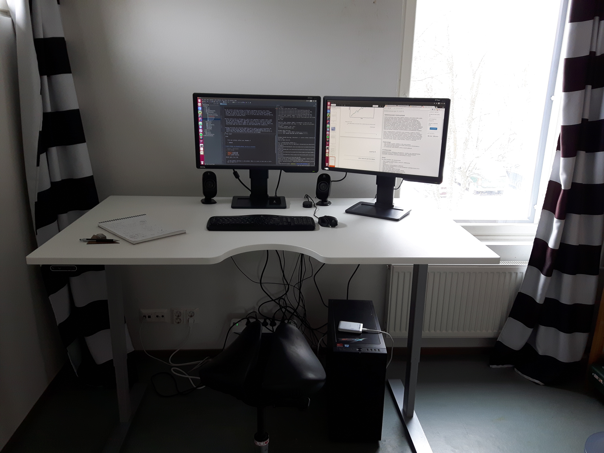

Landscape of my Life
====================

.. note::
   Annan luvan käyttää kirjoittamiani pohdintoja anonyymisti tutkimuksessa, jossa tutkitaan oppimista ja henkistä kasvua tällä kurssilla

Infomation

:name: Jaan Tollander de Balsch
:study program: TFM
:number-of-participated-lectures: 5

Source of the cover picture is from the *Limitless* movie [LimitlessCover]_, which fits well on the theme of the essay.

.. esa.luento@gmail.com

.. Hyödynnä
      - luennolla esiin tulleita teemoja, käsitteitä ja ajatussisältöjä soveltavasti ja pohdiskelevasti oman elämän näkökulmasta
      - kurssin käsitteistöjä, oheiskirjallisuutta ja omia kokemuksiasi

.. Tarkoitus
      - esseellä erittelet jäsentyneesti omia ajatuksiasi soveltaen kurssin ja sen oheislukemiston käsitteitä

.. Voit
      - kytkeä tarkastelemiasi asioita esimerkiksi johonkin itsesi kannalta merkitseviin teksteihin, henkilökohtaisiin kokemuksiisi, oman pääaineesi teemoihin tai oman tulevaisuutesi pohdintaan.

.. Essee on vapaamuotoinen
   1) kytkeytyen kurssin teemoihin
   2) otsikkona "Elämäni maisema" (mahdollisesti sisältäen oman alaotsikon)
   3) hyödyntäen kurssin käsitteitä ja esimerkkejä omaan elämääsi ja kokemuksiisi sovellettuina. Lisäansio on, jos
   4) essee sisältää viittauksia kurssin oheismateriaaliin (viittaukset vapaamuotoisesti tekstin sisällä tai alaviitteissä) sekä niistä kimmonneita pohdintoja. Mikäli lainaat aiemmin kirjoitettua (myös aiempaa omaa tekstiäsi), esitä lainaukset lainausmerkein, lähdemerkinnöin tai muulla tavoin selvästi. Esseen voi tehdä suomeksi, ruotsiksi tai englanniksi.

Foreword
--------
As a third year student of applied mathematics and computer sciences, my brains has been exposed to data structures, algorithms and equations, and of course caffeine. The views of this essay are results of that, and hopefully deviates from the views of an average person. This essay is written as thoughts about my life philosophies reflecting some of the topic discussed on the lectures. The focus is not so much on any individual topic, but the experience and teachings as whole.

Routines, Habits and Rituals
----------------------------

.. figure:: 20170331_073139.jpg
   :target: 20170331_073139.jpg
   :alt: Snowy Morning

   *Snowy Morning*

My mornings usually start waking up at around 07:00, drinking some water and eating two avocados seasoned with salt, followed my brief 15 minute walk in the outside. Morning walk is followed by brewing some coffee. Brewing coffee for some people means putting pre-ground coffee into the coffee machine and waiting four minutes for coffee to brew. Personally, I prefer using coffee beans and preparing it from ground up, using manual coffee grinder and Aeropress. This make way superior coffee, both in taste and effects, and makes a good way to start the day. Sometimes I boost my coffee with some butter and coconut / MCT oil, making what is called *Bulletproof* coffee [BulletproofCoffee]_. An alternative to coffee is another south American drink called *Yerba Mate* which also has great cognitive boosting effects. The purpose of these morning rituals or habits is to prepare the mind for the creative work of the day, such as writing this essay.

   *Altar of success*

The day usually continues working on different programming projects until midday. Projects vary from school projects to hobby projects, but the common goal is always the same, to improve core skills and craft routines for solving similar problems faster, but maybe the most important of all is to learn meta skills, meaning learning to become better at learning itself.

Morning creative work is followed by a walk to buy ingredient to prepare food. It also a good way to get some sunlight. Usual ingredients for fueling more cognitive and physical work for consist of vegetables, eggs, meat, butter, olive oil, spices and herbs. Starchy carbohydrates usually only if needed for replenishing glycogen or improve sleep since large blood sugar and insulin spikes are quite detrimental for productivity.

Evening activities vary from more cognitive work to sports or social activities. For example, around one year ago (winter, 2016) I started cheerleading, which is an interesting sport because it is a team sport that requires concentration and ability to learn new skills, because you are responsible for throwing (literally) other people in the air and catching them. It also benefits from flexibility, strength and stamina. When it comes to social activities, we can leverage the many *saunas* in Otaniemi as great place to meet other people (foreign too), enjoy hot sauna, socialize and potentially take swim in the ice cold sea. Not only does it offer the benefits of socializing after a day of beign inside of my own head, but also the health benefits of heat exposure and cold thermogenesis.

The common factor with all of these activities is that they attempt to induce the *"flow state"* [1]_ [FlowGenomeProject]_ one way or the other, which is almost a requirements to make great things happen. I believe that this was goal with the lectures as well.

Final important part of the day is going to sleep. Before sleep is usually great idea to have wind down period and avoid exposure to blue light. Good sleep ensures that the next day will be great learning opportunity as well.

   *"Let your actions reflect your thoughts."*

   -- Author

.. [1] In positive psychology, flow, also known as the zone, is the mental state of operation in which a person performing an activity is fully immersed in a feeling of energized focus, full involvement, and enjoyment in the process of the activity.

Growth Mindset -- Becoming Your Best Self
-----------------------------------------
.. Energy -> Motivation
.. Inner Dialog
.. Mental Models

.. figure:: growth.pdf
   :target: growth.pdf
   :alt: growth function
   :width: 70%

Its obvious from the previous chapter that my goals are focused on self improvement as many of the topics in the lectures were, ranging from giving more roses to our ladies to learning from Nelson Mandela or Lady Gaga.

My goals and mindset were not always favoring growth. Referring to the lecture on "Three lessons from Tarantino", my personal *Transformation* happened around three years ago, due to health reasons (which I have fixed since) and it has lead to quite significant change, both physically and mentally. The motivation to improve one's self, to reprogram bad *mental models* and harmful *inner talk* comes down to energy levels, sufficient hormone levels and neurotransmitters. These parameters can be affected by understanding your environment and changing it to benefit you. Some of these parameters are sufficient sunlight exposure, the air you breath and the edibles and liquids you consume. Unfortunately change often itself take energy, which if you are not well may be exactly what you don't have, and this is called negative feedback loop. Transformation comes down to finding a way to break this negative feedback loop and turning it into positive feedback loop. Positive feedback loops will lead to success and better life.

To ensure being in the positive feedback loop, listening, reading and learning from the master of this field. Some of my favourite podcasts in this field are [Bulletproof]_, [Ferriss]_, [Greenfield]_ and recent book by finnish authors called "Biohakkerin käsikirja" [BHkasikirja]_.

   *"A day without learning is a day wasted. There is so much to learn and so little time to learn it."*

   -- Albert Einstein

.. [LimitlessCover] (2017). Movies-illustrated.com. Retrieved 31 March 2017, from http://www.movies-illustrated.com/wp-content/uploads/2011/May/limitless-movie-review-1.jpg
.. [FlowGenomeProject] Flow Genome Project « The Official Source For Flow Science And Training. (2017). Flowgenomeproject.com. Retrieved 31 March 2017, from http://www.flowgenomeproject.com/
.. [Bulletproof] Bulletproof Radio Archives. (2017). Bulletproof. Retrieved 31 March 2017, from https://blog.bulletproof.com/category/podcasts/
.. [BulletproofCoffee] How to Make Bulletproof® Coffee w/ Dave Asprey. (2017). YouTube. Retrieved 31 March 2017, from https://www.youtube.com/watch?v=4YjLMdx3YZY
.. [Ferriss] Podcast – The Tim Ferriss Show. (2014). The Blog of Author Tim Ferriss. Retrieved 31 March 2017, from http://tim.blog/podcast/
.. [Greenfield] Podcasts - Ben Greenfield Fitness - Diet, Fat Loss and Performance Advice. (2017). Ben Greenfield Fitness - Diet, Fat Loss and Performance Advice. Retrieved 31 March 2017, from https://bengreenfieldfitness.com/podcasts/
.. [BHkasikirja] Arina, T., Sovijärvi, O., & Halmetoja, J. (2016). Biohakkerin käsikirja – Päivitä itsesi ja vapauta sisäinen potentiaalisi. Helsinki: Dicole Oy.
